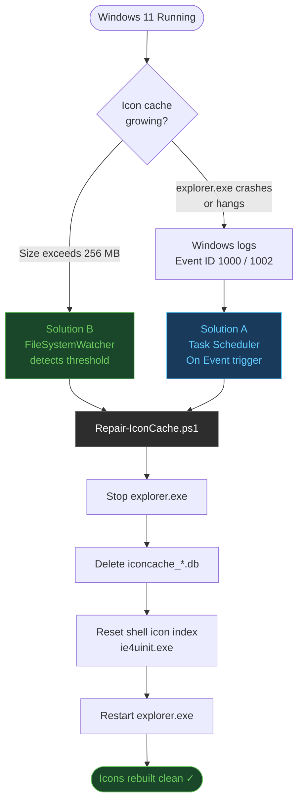

<p align="center">
  
</p>

<h1 align="center">icon-cache-self-healing</h1>

<p align="center">
  <strong>Event-driven, self-healing Windows 11 icon cache watchdog</strong><br/>
  The system notices the problem. The system fixes itself. You do nothing.
</p>

<p align="center">
  
  
  
  
  
</p>

---

## What This Does

Windows silently accumulates `iconcache_*.db` files inside `%LOCALAPPDATA%\Microsoft\Windows\Explorer`. When these files grow too large or become corrupted, you get missing icons, blank thumbnails, or Explorer crashes. Windows provides no native self-repair mechanism for this.

This toolkit installs a **two-layer watchdog system**:

| Layer | Mechanism | Trigger |
|---|---|---|
| **Solution A** | Task Scheduler (Event-Driven) | Explorer crash → Event ID 1000 / 1002 |
| **Solution B** | PowerShell Daemon (FileSystemWatcher) | File size exceeds threshold (default: 256 MB) |

Both layers are **silent, autonomous, and low-resource**. No popups. No scheduled reboots. No manual intervention.

---

## How It Works



---

## Quick Start

```powershell
# 1. Open PowerShell as Administrator
# 2. Navigate to this folder
cd "C:\path\to\icon-cache-self-healing"

# 3. Run the one-click installer
.\scripts\Register-Tasks.ps1

# 4. Verify installation
Get-ScheduledTask -TaskPath "\IconCache\" | Select-Object TaskName, State
```

**Expected result:**
```
TaskName     State
--------     -----
EventRepair  Ready    ← dormant, listening for Event ID 1000/1002
Watchdog     Running  ← active right now, watching file sizes
```

That's it. Both solutions are now active. The system watches itself from here.

---

## Folder Structure

```
icon-cache-self-healing/
├── readme.md                        ← You are here
├── assets/
│   └── banner.png                   ← Project visual
├── docs/
│   ├── architecture.md              ← System design, event ID analysis, flow diagrams
│   └── implementation-guide.md      ← Step-by-step setup on a new machine
├── scripts/
│   ├── Repair-IconCache.ps1         ← Core repair logic (run standalone or triggered)
│   ├── Watch-IconCache.ps1          ← Watchdog daemon (FileSystemWatcher-based)
│   └── Register-Tasks.ps1          ← One-click installer for both solutions
├── tasks/
│   └── icon-cache-event-repair.xml  ← Task Scheduler XML (Event ID 1000/1002 triggers)
└── logs/                            ← Auto-created at runtime (gitignored)
```

---

## Requirements

- Windows 10 21H2 or Windows 11 (any version)
- PowerShell 5.1+ (built-in on all modern Windows)
- Administrator rights (required for Task Scheduler registration only)
- No third-party dependencies

---

## Why Two Solutions?

**Solution B** is the oil pressure gauge — it watches the cache grow and intervenes *before* a crash ever happens.

**Solution A** is the airbag — if something slips through below the threshold and Explorer crashes anyway, it fires as the fallback.

Together there is no realistic scenario that falls through the cracks.

---

## Smoke Test

```powershell
# Force a manual repair to verify everything works
.\scripts\Repair-IconCache.ps1 -Force

# Check the result
Get-Content .\logs\IconCacheRepair.log
```

You will see Explorer briefly disappear and restart (3–5 seconds). That is expected and correct.

---

## Uninstall

```powershell
# Remove both scheduled tasks
Unregister-ScheduledTask -TaskPath "\IconCache\" -TaskName "EventRepair" -Confirm:$false
Unregister-ScheduledTask -TaskPath "\IconCache\" -TaskName "Watchdog"    -Confirm:$false

# Remove task folder
$scheduler = New-Object -ComObject Schedule.Service
$scheduler.Connect()
$scheduler.GetFolder("\").DeleteFolder("IconCache", 0)
```

---

## Naming Conventions

This project follows [`naming-conventions-policy-v3.2.0`](docs/architecture.md):

| File Type | Rule | Example |
|---|---|---|
| PowerShell `.ps1` | Style C: `Verb-Noun` | `Repair-IconCache.ps1` |
| Markdown `.md` | Style B: `kebab-case` | `implementation-guide.md` |
| XML config | Style B: `kebab-case` | `icon-cache-event-repair.xml` |
| Directories | Style B: `kebab-case` | `scripts/`, `docs/`, `tasks/` |

---

<p align="center">
  Built with intent. Maintained by the system itself.
</p>
