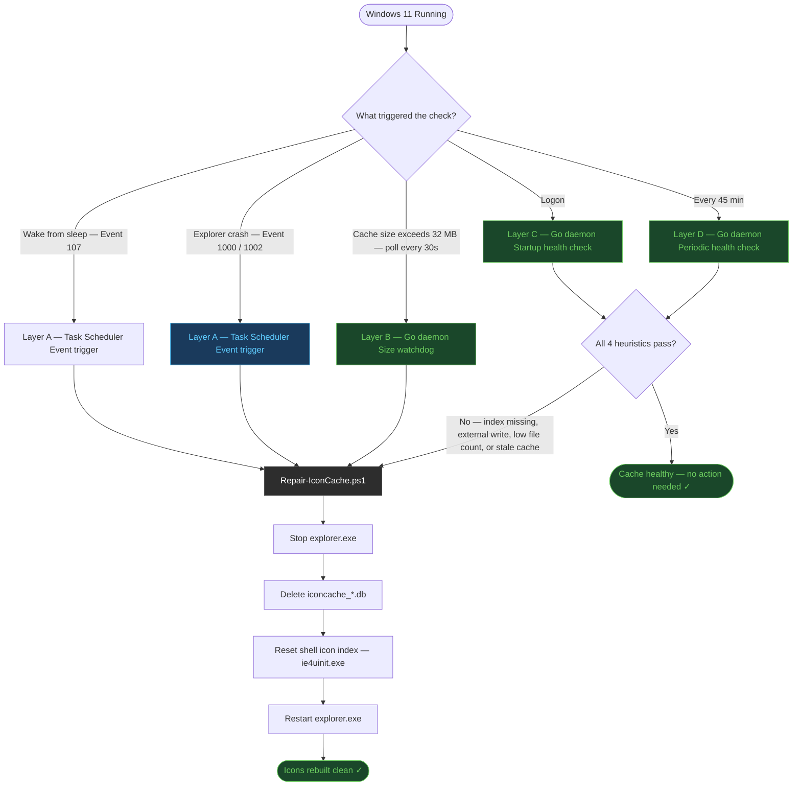

<p align="center">
  
</p>

<h1 align="center">icon-cache-self-healing</h1>

<p align="center">
  <strong>Event-driven, self-healing Windows 11 icon cache watchdog</strong><br/>
  The system notices the problem. The system fixes itself. You do nothing.
</p>

<p align="center">
  
  
  
  
  
  
</p>

---

## What This Does

Windows silently accumulates `iconcache_*.db` files inside `%LOCALAPPDATA%\Microsoft\Windows\Explorer`. When these files grow too large or become corrupted — by updates, installers, or cleanup tools — you get missing icons, blank thumbnails, or Explorer crashes. Windows provides no native self-repair mechanism for this.

This toolkit installs a **four-layer self-healing system**:

| Layer | Mechanism | Trigger |
|---|---|---|
| **A** | Task Scheduler (Event-Driven) | Explorer crash → Event ID 1000 / 1002 |
| **A** | Task Scheduler (Event-Driven) | Wake from sleep → Event ID 107 |
| **B** | Go daemon — size polling (30s) | Cache exceeds 32 MB |
| **C** | Go daemon — startup health check | Every logon |
| **D** | Go daemon — periodic health check | Every 45 minutes |

The runtime is a compiled **Go binary** (`icon-cache-watchdog.exe`) running as a Windows GUI-subsystem process. No console window. No terminal flash. No visible footprint of any kind.

---

## How It Works



---

## Quick Start

```powershell
# 1. Install Go 1.20+ from https://go.dev/dl/ (one-time, required to build the daemon)

# 2. Open PowerShell as Administrator and navigate to this folder
cd "C:\path\to\icon-cache-self-healing"

# 3. Compile the silent Go daemon
.\scripts\Build-Daemon.ps1

# 4. Register all tasks and start the daemon
.\scripts\Register-Tasks.ps1

# 5. Verify
Get-ScheduledTask -TaskPath "\IconCache\" | Select-Object TaskName, State
```

**Expected result:**
```
TaskName      State
--------      -----
EventRepair   Ready    ← dormant, listening for Event ID 1000/1002/107
Watchdog      Running  ← Go daemon active, fully silent, no window
```

That's it. The system watches itself from here. No reboots required.

---

## Folder Structure

```
icon-cache-self-healing/
├── readme.md
├── assets/
│   └── banner.png
├── bin/
│   └── icon-cache-watchdog.exe    ← compiled output (gitignored, build locally)
├── daemon/
│   ├── main.go                    ← Go source — all four layers in one binary
│   ├── syscall_windows.go         ← Windows CREATE_NO_WINDOW flag
│   ├── syscall_other.go           ← Linux/macOS build stub
│   └── go.mod                     ← Go module definition
├── docs/
│   ├── architecture.md            ← System design and layer analysis
│   └── implementation-guide.md    ← Step-by-step setup on a new machine
├── scripts/
│   ├── Build-Daemon.ps1           ← Compiles icon-cache-watchdog.exe
│   ├── Register-Tasks.ps1         ← Installs Task Scheduler tasks (run as Admin)
│   ├── Repair-IconCache.ps1       ← Core repair logic (called by daemon and Layer A)
│   ├── Watch-IconCache.ps1        ← Reference implementation of Layer B (PowerShell)
│   └── Test-IconCacheHealth.ps1   ← Reference implementation of Layer C+D (PowerShell)
├── tasks/
│   └── icon-cache-event-repair.xml ← Task Scheduler XML reference (Layer A)
└── logs/                           ← Auto-created at runtime (gitignored)
    ├── Watchdog.log
    ├── IconCacheHealth.log
    └── IconCacheRepair.log
```

---

## Why a Go Binary?

The PowerShell scripts (`Watch-IconCache.ps1`, `Test-IconCacheHealth.ps1`) exist in this repo as **readable reference implementations** — they document exactly what the system does in plain, auditable code.

The production runtime is `icon-cache-watchdog.exe`, compiled from `daemon/main.go`. Here is why:

`powershell.exe` and `pwsh.exe` are **console-subsystem** executables. Windows always allocates a `conhost.exe` console window when launching them — even with `-WindowStyle Hidden`. This causes a terminal flash at every logon, every repair, every health check.

The Go binary is compiled with `-ldflags="-H windowsgui"`, making it a **GUI-subsystem** executable. Windows never allocates a console for GUI-subsystem processes. Combined with the `CREATE_NO_WINDOW` flag on all child processes it spawns, the entire system is completely invisible — permanently.

---

## Health Check Heuristics

The daemon runs four heuristics every 45 minutes and at logon:

| # | Heuristic | What it detects |
|---|---|---|
| H1 | `iconcache_idx.db` missing or < 100 bytes | Broken or empty index |
| H2 | `iconcache_256.db` written while Explorer not running | External process corrupted cache (winget, updates) |
| H3 | Fewer than 5 cache files while Explorer is running | Abnormal deletion |
| H4 | Cache not updated in 30+ days | Staleness — preemptive refresh |

If any heuristic fails, repair triggers automatically.

---

## Requirements

- Windows 10 21H2 or Windows 11 (any version)
- PowerShell 5.1+ (built-in, used by repair script)
- Go 1.20+ (required to build the daemon — [download](https://go.dev/dl/))
- Administrator rights (required for Task Scheduler registration only)
- No runtime dependencies — the compiled binary is fully self-contained

---

## Smoke Test

```powershell
# Force a manual repair to verify everything works
.\scripts\Repair-IconCache.ps1 -Force

# Check repair log
Get-Content .\logs\IconCacheRepair.log -Tail 20

# Check daemon is alive and health checks are passing
Get-Content .\logs\Watchdog.log -Tail 10
Get-Content .\logs\IconCacheHealth.log -Tail 10
```

Explorer will briefly disappear and restart (3–5 seconds). That is expected and correct.

---

## Uninstall

```powershell
# Stop and remove scheduled tasks
Unregister-ScheduledTask -TaskPath "\IconCache\" -TaskName "EventRepair" -Confirm:$false
Unregister-ScheduledTask -TaskPath "\IconCache\" -TaskName "Watchdog"    -Confirm:$false

# Remove task folder
$scheduler = New-Object -ComObject Schedule.Service
$scheduler.Connect()
$scheduler.GetFolder("\").DeleteFolder("IconCache", 0)
```

Then delete the project folder. No registry entries. No system files modified.

---

## Naming Conventions

This project follows [`naming-conventions-policy-v3.2.0`](docs/architecture.md):

| File Type | Rule | Example |
|---|---|---|
| PowerShell `.ps1` | Style C: `Verb-Noun` | `Repair-IconCache.ps1` |
| Markdown `.md` | Style B: `kebab-case` | `implementation-guide.md` |
| XML config | Style B: `kebab-case` | `icon-cache-event-repair.xml` |
| Go source | Style B: `snake_case` | `syscall_windows.go` |
| Directories | Style B: `kebab-case` | `scripts/`, `docs/`, `daemon/` |

---

<p align="center">
  Built with intent. Maintained by the system itself.
</p>
